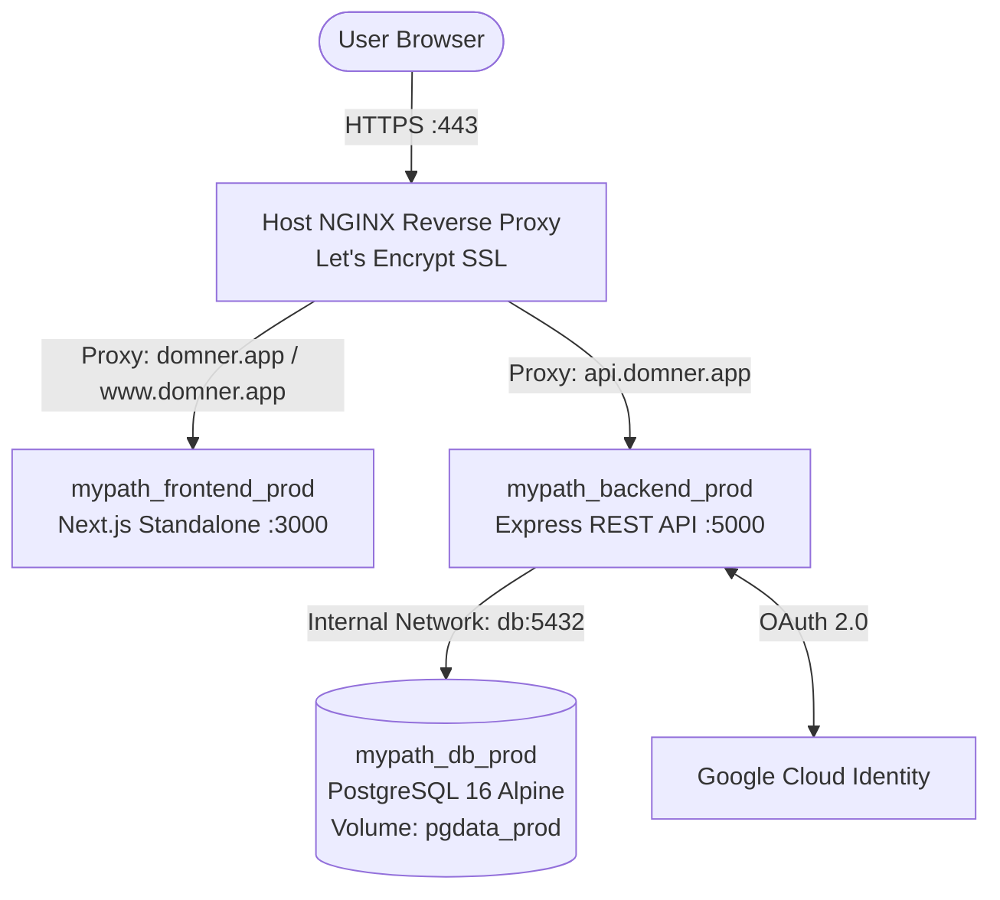

# 🚀 Domner (MyPath) Production Deployment Guide

Complete, step-by-step production documentation for hosting **Domner (`domner.app`)** on an **UpCloud Ubuntu VM** using **Docker Compose**, **PostgreSQL 16**, **Host NGINX**, and **Certbot SSL**.

---

## 🏗 Architecture Overview



### Server Stack
* **Server OS**: Ubuntu 22.04 / 24.04 LTS (UpCloud VM)
* **Domain**: `domner.app` (Registered at Name.com)
* **Frontend**: Next.js 16 (App Router, Standalone Docker container) on port `3000`
* **Backend**: Node.js Express API on port `5000`
* **Database**: PostgreSQL 16 Alpine in Docker with persistent volume `pgdata_prod`
* **Sessions**: PostgreSQL-backed session store (`connect-pg-simple`)
* **Reverse Proxy**: Host NGINX with automatic HTTP-to-HTTPS redirect
* **SSL Certificates**: Let's Encrypt managed by Certbot with auto-renewal

---

## 🌐 1. DNS Configuration (Name.com)

In your [Name.com](https://www.name.com) account under **Manage DNS Records** for `domner.app`, configure these 3 records:

| Type | Host / Subdomain | Answer / Target | TTL | Purpose |
| :--- | :--- | :--- | :--- | :--- |
| **A** | *(leave empty or `@`)* | `<YOUR_SERVER_IP>` | `300` | Main frontend website |
| **A** | `api` | `<YOUR_SERVER_IP>` | `300` | Backend REST API |
| **CNAME** | `www` | `domner.app` | `300` | WWW redirect alias |

> [!TIP]
> Remove any default parking or placeholder records that Name.com created automatically.

---

## 💻 2. Server Initial Setup & Packages

Connect to your server via SSH:
```bash
ssh root@<YOUR_SERVER_IP>
```

Install Docker, NGINX, and Certbot:
```bash
# 1. Update system packages
apt update && apt upgrade -y

# 2. Install official Docker Engine & Docker Compose plugin
curl -fsSL https://get.docker.com -o get-docker.sh
sh get-docker.sh
systemctl enable --now docker

# 3. Install NGINX
apt install -y nginx
systemctl enable --now nginx

# 4. Install Certbot & NGINX plugin
apt install -y certbot python3-certbot-nginx

# 5. Open Firewall (UFW)
ufw allow 22/tcp comment 'SSH'
ufw allow 80/tcp comment 'HTTP'
ufw allow 443/tcp comment 'HTTPS'
ufw --force enable
```

---

## 🗂 3. Clone Repository & Setup Folder

```bash
# Navigate to /opt
mkdir -p /opt/mypath
cd /opt/mypath

# Clone your project repository (adjust branch if needed)
git clone -b deployment-testing https://github.com/Iunasia/MyPath.git .
```

---

## ⚙️ 4. Environment Variables (`.env.prod`)

Create `.env.prod` inside `/opt/mypath/MyPath`:

```bash
cd /opt/mypath/MyPath
cp .env.prod.example .env.prod
nano .env.prod
```

### Complete Production `.env.prod` Template:

```env
# ==============================================================================
# Domner Production Environment Configuration
# ==============================================================================

# --- 1. Domains & Routing -----------------------------------------------------
DOMAIN=domner.app
API_DOMAIN=api.domner.app

# --- 2. Application URLs ------------------------------------------------------
FRONTEND_URL=https://domner.app
NEXT_PUBLIC_API_URL=https://api.domner.app
COOKIE_DOMAIN=.domner.app

# --- 3. Database (Self-hosted inside Docker) ----------------------------------
POSTGRES_USER=mypath
POSTGRES_PASSWORD=YourStrongDatabasePassword2026!
POSTGRES_DB=mypath
DATABASE_URL=postgres://mypath:YourStrongDatabasePassword2026!@db:5432/mypath
DATABASE_SSL=false

# --- 4. Session & Security ----------------------------------------------------
SESSION_SECRET=a_very_long_and_cryptographically_secure_random_string_min_32_chars

# --- 5. Initial Administrator (Bootstrapped by seed) --------------------------
SEED_ADMIN_EMAIL=admin@domner.app
SEED_ADMIN_PASSWORD=YourAdminPassword2026!

# --- 6. Google OAuth 2.0 ("Sign in with Google") ------------------------------
GOOGLE_CLIENT_ID=your-client-id.apps.googleusercontent.com
GOOGLE_CLIENT_SECRET=GOCSPX-your-client-secret
GOOGLE_CALLBACK_URL=https://api.domner.app/auth/google/callback
```

Make sure Docker Compose substitutions pick up your values:
```bash
cp .env.prod .env
```

---

## 🔑 5. Google OAuth 2.0 Setup

1. Open **[Google Cloud Console](https://console.cloud.google.com/)** and create a project named **Domner**.
2. Go to **APIs & Services ➔ OAuth consent screen**:
   - Select **User Type: External**.
   - App Name: `Domner`.
   - User support email: `your-email@gmail.com`.
   - Authorized domain: `domner.app`.
3. Go to **APIs & Services ➔ Credentials**:
   - Click **+ CREATE CREDENTIALS ➔ OAuth client ID**.
   - Application type: **Web application**.
   - Name: `Domner Web App`.
   - **Authorized JavaScript origins**:
     - `https://domner.app`
     - `https://www.domner.app`
     - `https://api.domner.app`
   - **Authorized redirect URIs** *(⚠️ Must be exact)*:
     - `https://api.domner.app/auth/google/callback`
4. Copy the generated **Client ID** and **Client Secret** into `.env.prod`.

---

## 🐳 6. Build and Run Docker Containers

Launch PostgreSQL, Backend, and Frontend:

```bash
# 1. Build and start containers
docker compose -f docker-compose.prod.yml up -d --build

# 2. Wait 10 seconds for PostgreSQL to initialize
sleep 10

# 3. Seed database tables, initial admin user, and sample data
docker compose -f docker-compose.prod.yml exec backend npm run seed
```

Verify all containers are up and healthy:
```bash
docker compose -f docker-compose.prod.yml ps
```
*Expected status:*
- `mypath_db_prod` (healthy)
- `mypath_backend_prod` (Up, port `5000`)
- `mypath_frontend_prod` (Up, port `3000`)

---

## 📄 7. Configure Host NGINX Reverse Proxy

Create the NGINX site file:
```bash
nano /etc/nginx/sites-available/domner
```

Paste the following configuration:

```nginx
# =======================================================
# 1. Backend API (api.domner.app) -> Express :5000
# =======================================================
server {
    listen 80;
    listen [::]:80;
    server_name api.domner.app;

    client_max_body_size 50M;

    location / {
        proxy_pass http://127.0.0.1:5000;
        proxy_http_version 1.1;
        proxy_set_header Upgrade $http_upgrade;
        proxy_set_header Connection 'upgrade';
        proxy_set_header Host $host;
        proxy_set_header X-Real-IP $remote_addr;
        proxy_set_header X-Forwarded-For $proxy_add_x_forwarded_for;
        proxy_set_header X-Forwarded-Proto $scheme;
        proxy_cache_bypass $http_upgrade;
    }
}

# =======================================================
# 2. Frontend UI (domner.app & www.domner.app) -> Next.js :3000
# =======================================================
server {
    listen 80;
    listen [::]:80;
    server_name domner.app www.domner.app;

    client_max_body_size 50M;

    location / {
        proxy_pass http://127.0.0.1:3000;
        proxy_http_version 1.1;
        proxy_set_header Upgrade $http_upgrade;
        proxy_set_header Connection 'upgrade';
        proxy_set_header Host $host;
        proxy_set_header X-Real-IP $remote_addr;
        proxy_set_header X-Forwarded-For $proxy_add_x_forwarded_for;
        proxy_set_header X-Forwarded-Proto $scheme;
        proxy_cache_bypass $http_upgrade;
    }
}
```

Enable the configuration and reload NGINX:
```bash
# Symlink to sites-enabled
ln -sf /etc/nginx/sites-available/domner /etc/nginx/sites-enabled/

# Remove default Ubuntu page
rm -f /etc/nginx/sites-enabled/default

# Test configuration
nginx -t

# Reload NGINX
systemctl reload nginx
```

---

## 🔒 8. Install SSL Certificates (Certbot)

Run Certbot to request free Let's Encrypt certificates for all domains:

```bash
certbot --nginx -d domner.app -d www.domner.app -d api.domner.app
```

Certbot will automatically:
1. Verify domain ownership against Name.com DNS.
2. Obtain trusted SSL certificates.
3. Automatically update `/etc/nginx/sites-available/domner` with HTTPS port 443 and SSL protocols.
4. Set up an automatic background systemd renewal timer.

Test auto-renewal:
```bash
certbot renew --dry-run
```

---

## 💡 9. Production Gotchas & Lessons Learned

| Issue | Root Cause | Solution |
| :--- | :--- | :--- |
| **`ERR_CONNECTION_REFUSED` on `.app`** | `.app` TLD is on Google's HSTS preload list and mandates HTTPS (port 443). If Certbot hasn't created the SSL port 443 block, browsers refuse connection. | Run `certbot --nginx` to activate port 443. |
| **`The server does not support SSL connections`** | Connecting to PostgreSQL inside Docker over the internal network does not use SSL. | Set `DATABASE_SSL=false` and remove `?sslmode=require` from `DATABASE_URL`. |
| **`password authentication failed for user "mypath"`** | PostgreSQL Docker initializes the user password ONLY on the first volume creation. If passwords change in `.env.prod` afterwards, the existing volume ignores it. | Reset volume on fresh setup: `docker compose down -v` then `docker compose up -d`. |
| **`api.mypath.com took too long to respond`** | Next.js bakes `NEXT_PUBLIC_API_URL` into client JS **at build time**. Changing `.env.prod` doesn't update existing compiled bundles. | Rebuild frontend without cache: `docker compose build --no-cache frontend && docker compose up -d frontend`. |
| **`Error 400: redirect_uri_mismatch`** | Google OAuth callback must match character-for-character. | Ensure `https://api.domner.app/auth/google/callback` is listed under **Authorized redirect URIs** in Google Cloud Console. |
| **`docker compose restart` doesn't update `.env`** | `restart` only restarts the running container process; it does not reload `env_file`. | Always use `docker compose up -d backend` (or `--force-recreate`). |

---

## 🛠 10. Maintenance & Day-to-Day Operations

### View Live Logs
```bash
# All logs
docker compose -f docker-compose.prod.yml logs -f

# Backend API logs only
docker compose -f docker-compose.prod.yml logs -f backend

# Frontend logs only
docker compose -f docker-compose.prod.yml logs -f frontend

# NGINX access / error logs
tail -f /var/log/nginx/error.log
tail -f /var/log/nginx/access.log
```

### Pull Updates & Re-deploy Code
```bash
cd /opt/mypath/MyPath
git pull origin deployment-testing

# If backend changed:
docker compose -f docker-compose.prod.yml up -d --build backend

# If frontend changed:
docker compose -f docker-compose.prod.yml build --no-cache frontend
docker compose -f docker-compose.prod.yml up -d frontend
```

### Backup & Restore Database
```bash
# Create a timestamped backup
docker compose -f docker-compose.prod.yml exec -T db pg_dump -U mypath mypath > backup_$(date +%F_%T).sql

# Restore from a backup
cat backup_2026-09-14.sql | docker compose -f docker-compose.prod.yml exec -T db psql -U mypath mypath
```
